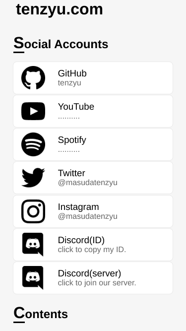
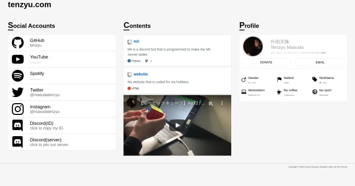

# tenzyu.com

This is a website that has written my Accounts, Contents and Profile. 
I also plan to create a portfolio and blog in the near future.

## Web ScreenShots

(generated on July 18)

## Requirement

* HTML
* CSS
* JavaScript

### Note

* Most of the CSS has not been tested on real machines.
* The only environment I checked for tenzyu.com was Google Chrome on macOS.
* The hosting service I'm using to run this is Netlify.

### Author

* Tenzyu Masuda
* Twitter : <https://twitter.com/masudatenzyu>

### License

tenzyu.com is under [MIT license](https://github.com/tenzyu/website/blob/master/LICENSE).
